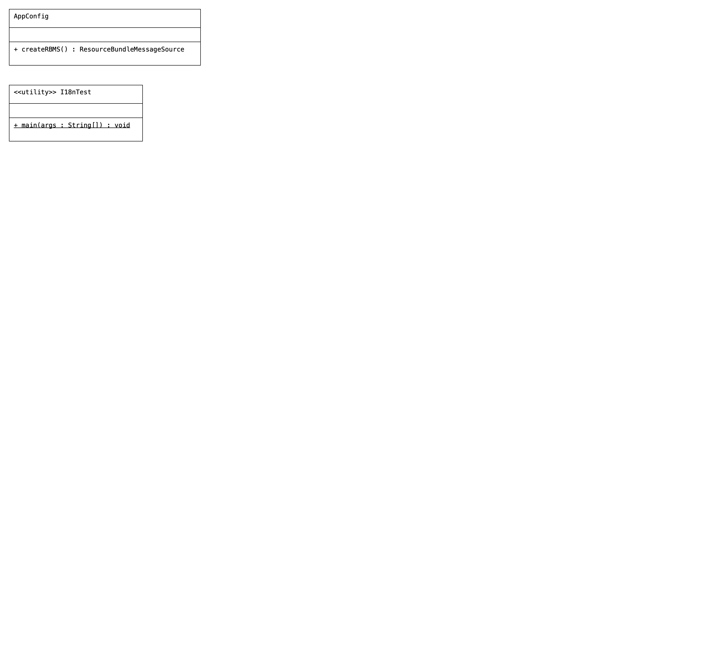

# IOCProj09-ApplicationContext-I18n

# Code

```Java
package com.local.config;

import org.springframework.context.annotation.Bean;
import org.springframework.context.annotation.Configuration;
import org.springframework.context.support.ResourceBundleMessageSource;

@Configuration
public class AppConfig {


    @Bean(name = "messageSource")  //fixed bean id
    public ResourceBundleMessageSource createRBMS() {
        ResourceBundleMessageSource source = new ResourceBundleMessageSource();
        source.setBasename("com/local/commons/App");
        return source;

    }

}

package com.local.main;

import java.util.Locale;
import java.util.Scanner;

import org.springframework.context.annotation.AnnotationConfigApplicationContext;

import com.local.config.AppConfig;

public class I18nTest {

    public static void main(String[] args) {
        //create IOC container
        AnnotationConfigApplicationContext ctx = new AnnotationConfigApplicationContext(AppConfig.class);
        //read  language and country from enduser
        Scanner sc = new Scanner(System.in);
        System.out.println("enter Language code::");
        String lang = sc.next();
        System.out.println("enter Country code::");
        String country = sc.next();
        //prepare Locale object having language, country code
        Locale locale = new Locale(lang, country);

        String msg1 = ctx.getMessage("welcome.message", new Object[]{}, locale);
        String msg2 = ctx.getMessage("goodbye.message", new Object[]{}, locale);
        String msg3 = ctx.getMessage("newyear.wishes", new Object[]{}, locale);

        System.out.println(msg1 + "......." + msg2 + "......" + msg3);

        ctx.close();
    }

}

````

# POM
```xml
    <dependencies>
        <!-- https://mvnrepository.com/artifact/org.springframework/spring-context-support -->
        <dependency>
            <groupId>org.springframework</groupId>
            <artifactId>spring-context-support</artifactId>
            <version>6.1.5</version>
        </dependency>
    </dependencies>
```


# Properties

```properties
#Base File (English)
welcome.message=GoodMorning
goodbye.message= See You Later
newyear.wishes= Happy NewYear

```

```properties
#(German)
welcome.message=Guten Morgen
goodbye.message=Bis später
newyear.wishes=Frohes neues Jahr

```

```properties
#Base File (French)
Welcome.message=Bonjour
goodbye.message= À plus tard
newyear.wishes= Bonne année
```

```properties
#(Hindi)
welcome.message=\u0938\u0941\u092A\u094D\u0930\u092D\u093E\u0924
goodbye.message=\u092C\u093E\u0926 \u092E\u0947\u0902 \u092E\u093F\u0932\u0924\u0947 \u0939\u0948\u0902
newyear.wishes=\u0928\u092F\u093E \u0938\u093E\u0932 \u092E\u0941\u092C\u093E\u0930\u0915

```

```properties
#(	Telugu)
welcome.message=\u0C36\u0C41\u0C2D\u0C4B\u0C26\u0C2F\u0C02
goodbye.message= \u0C24\u0C30\u0C4D\u0C35\u0C3E\u0C24 \u0C15\u0C32\u0C41\u0C26\u0C4D\u0C26\u0C3E\u0C02
newyear.wishes= \u0C28\u0C42\u0C24\u0C28 \u0C38\u0C02\u0C35\u0C24\u0C4D\u0C38\u0C30 \u0C36\u0C41\u0C2D\u0C3E\u0C15\u0C3E\u0C02\u0C15\u0C4D\u0C37\u0C32\u0C41
```

# UML
